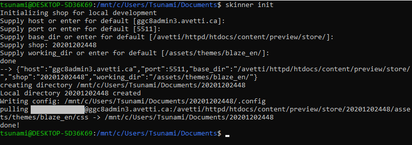
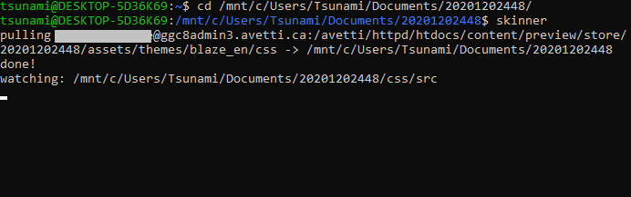

# tinySkinner

A tiny, high performance skinner

## How it works

tinySkinner will initialize a local directory to match a remote directory containing scss stylesheets, monitor for local file changes, compile, and keep remote and local copies mirrored using the rsync protocol. Work on multiple sites. Re-skin a site anytime without pulling every file down.

## Install

tinySkinner is built with nodejs, and relies on rsync.

### Dependencies
* On Linux: Install nodejs, npm, rsync. (apt install nodejs npm rsync)

* On MacOS: Download and install nodejs: [here](https://nodejs.org/en/download/)

* On Windows: Enable Windows Subsystem for Linux ```(Control Panel -> Programs and Features -> Turn Windows Feature on or off -> Check Windows Subsystem for Linux)```. Then, snag a linux distro from Microsoft's app store (search debian, or ubuntu). If installing natively on Windows, you'll need to use Cygwin to support rsync, after you install nodejs.

### setup 
Snag a copy of the source using git
```git clone https://github.com/jwpaine/skinner.git ```
Or download a zip [here](https://github.com/jwpaine/skinner/archive/refs/heads/master.zip)

Navigate to the directory in a terminal, and type 'npm install'

Make the skinner.js file executable:

``` chmod +x skinner.js ```
Add skinner.js to your $PATH (In Linux/MacOS, I created a symlink from my install location, to a spot on my filesystem)
``` sudo ln -s /home/John/skinner/skinner.js /usr/local/bin/skinner ```

### configuration

The first time you call skinner init, in a terminal, you should be prompted for your SSH username and private key location. These will be saved to a .skinnerrc file, within your home directory.

## Usage

### initalize a new working directory

In a terminal, type ```skinner init``` to setup a new working directory. Fill in values or accept defaults by pressing enter. a .config file will be written to the location of the working directory, and remote files will be synced down.



### start skinning!

In a terminal, enter in a working directory (cd 123456789/) and type ```skinner```. TinySkinner will compare local changes to remote, and sync down any partial file changes, and then begin monitoring for local file changes. When a change is detected, stylesheets will be compiled, and changes will be synced up. Quit anytime and return to your working directory, and begin where you left off! Change the name of any working directory for easier reference if needed.



